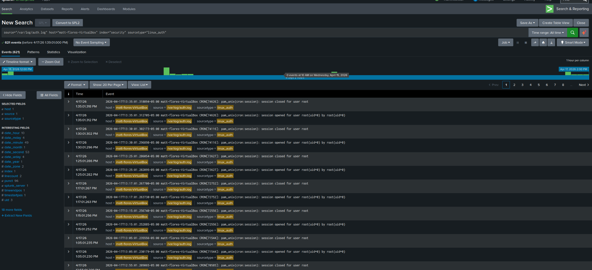
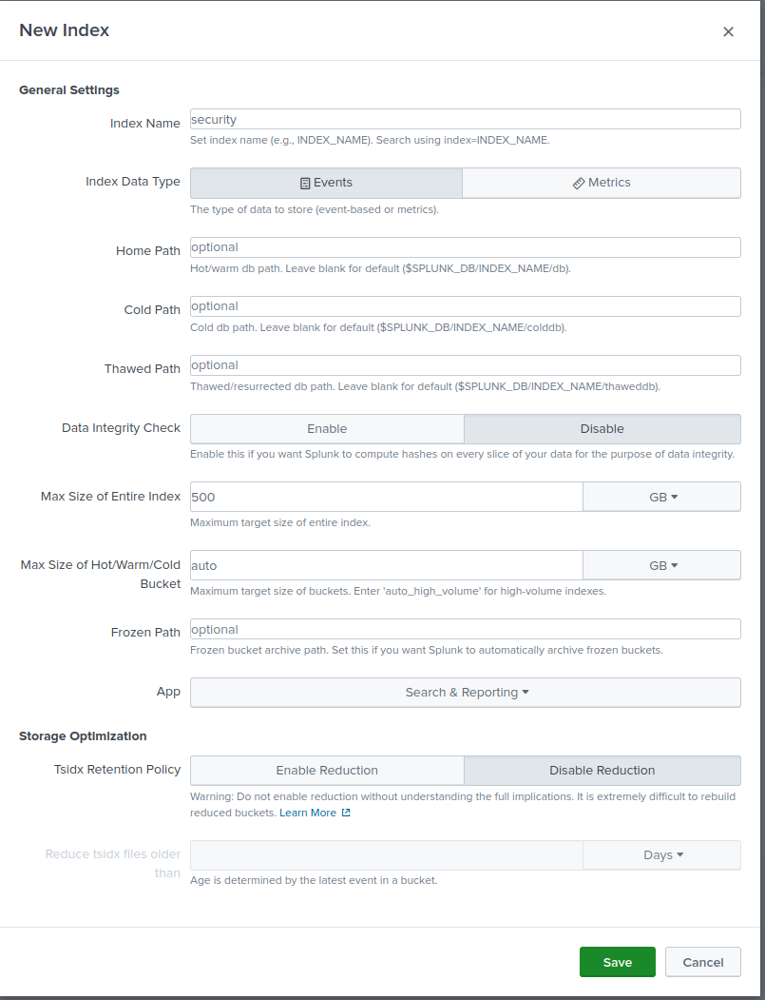
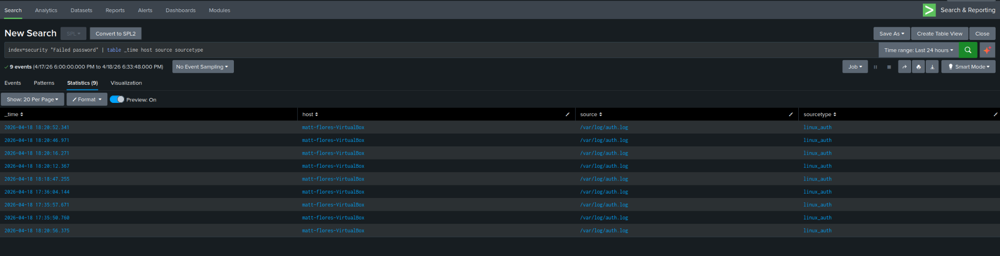
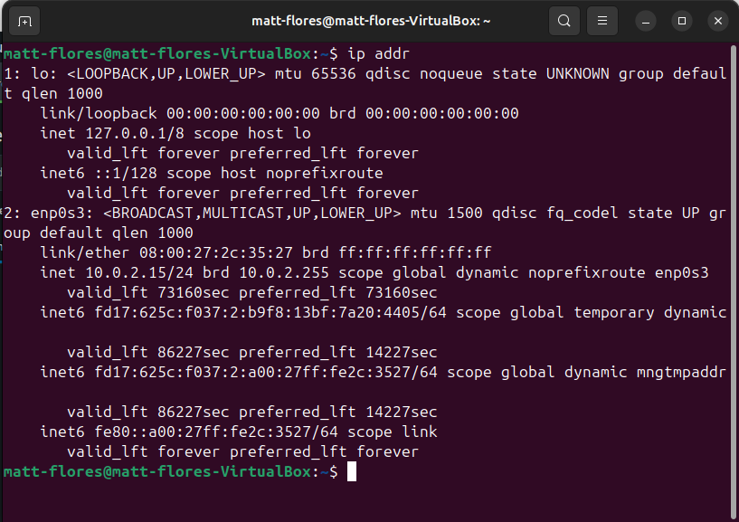
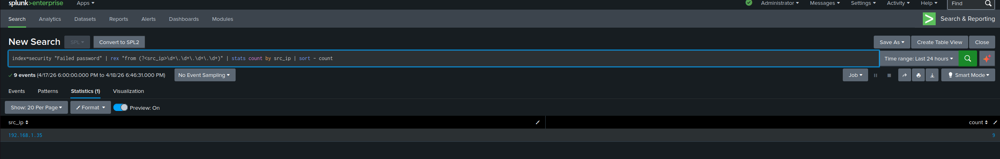

# Splunk Linux Authentication Monitoring and Threat Detection Lab

## Overview

This project demonstrates how I used Splunk to monitor and analyze Linux authentication activity in an Ubuntu virtual machine lab.

The goal was to ingest authentication logs, detect failed login attempts, and identify patterns that could indicate brute-force behavior.

---

## Objectives

- Install and configure Splunk Enterprise on an Ubuntu virtual machine
- Monitor Linux authentication activity from `/var/log/auth.log`
- Store events in a dedicated `security` index
- Detect failed local authentication activity
- Simulate failed SSH login attempts from an external host
- Build searches to identify repeated failed logins and possible brute-force patterns

---

## Lab Environment

- Host system: Windows PC
- Virtualization platform: Oracle VirtualBox
- Guest system: Ubuntu
- SIEM platform: Splunk Enterprise
- Log source: `/var/log/auth.log`
- Custom index: `security`
- Source type: `linux_auth`

---

## Project Workflow

### 1. Splunk Installation and Initial Configuration

Splunk Enterprise was installed on the Ubuntu virtual machine.

After installation, I verified access through the Splunk web interface and confirmed the environment was ready for log ingestion and analysis.

---

### 2. Log Ingestion Setup

I configured Splunk to continuously monitor `/var/log/auth.log`.

This log file contains important authentication-related events, including:

- SSH login attempts
- Failed password attempts
- `su` authentication failures
- Session activity
- PAM-related authentication events

Continuous monitoring ensured that new log events were searchable in Splunk as they were generated.

---

### 3. Security Index Creation

I created a dedicated index named `security` to keep authentication data separate from other events.

Using a dedicated index made the lab more organized and allowed for more focused searches such as `index=security`.

---

### 4. Verification of Ingested Logs

After configuring ingestion, I verified that authentication events from `/var/log/auth.log` were appearing in Splunk.

This confirmed that:

- Splunk was monitoring the correct file
- Data was being ingested successfully
- The `security` index was working as expected
- The `linux_auth` source type was being applied

At this point, the log pipeline from Ubuntu to Splunk was functioning correctly.

---

### 5. Detection of Local Authentication Failures

The first detection use case focused on local failed authentication activity using `su`.

I intentionally generated failed `su` attempts inside the Ubuntu VM and then searched for those events in Splunk.

This showed that the environment could detect:

- Failed `su` attempts
- PAM authentication failures
- Local privilege escalation attempts that did not succeed

---

### 6. SSH Service Enablement

To expand the lab into a more realistic remote access scenario, I installed and enabled the OpenSSH server on the Ubuntu VM.

I then verified that the SSH service was active and listening on port 22 so the VM could accept remote login attempts.

---

### 7. Network Connectivity Validation

To simulate external login attempts, I confirmed network connectivity between the Windows host and the Ubuntu VM.

This included validating:

- The Ubuntu VM IP address
- Host-to-VM communication
- SSH availability on the target system

This step was important because it allowed the VM to function as a reachable network target.

---

### 8. Attack Simulation

From the Windows host, I initiated multiple failed SSH login attempts against the Ubuntu VM using invalid credentials.

These attempts generated failed authentication events in `/var/log/auth.log`, which were then ingested into Splunk for analysis.

This simulation created a realistic dataset for investigating suspicious authentication behavior.

---

## Splunk Searches Used

### Failed SSH Login Detection

Search used: `index=security "Failed password"`

This search was used to confirm that failed SSH login attempts were being captured successfully.

---

### Event Review

Search used: `index=security "Failed password" | table _time host source sourcetype`

This provided a cleaner view of the failed login events and helped verify the source, timestamp, and log origin.

---

### Source IP Extraction

Search used: `index=security "Failed password" | rex "from (?<src_ip>\d+\.\d+\.\d+\.\d+)" | stats count by src_ip`

This search extracted the attacking IP address from the raw log message and counted the number of failed attempts by source.

---

### Brute-Force Pattern Detection

Search used: `index=security "Failed password" | rex "from (?<src_ip>\d+\.\d+\.\d+\.\d+)" | bucket _time span=1m | stats count by _time, src_ip`

This search grouped failed login attempts into one-minute windows to show repeated activity from the same source over time.

This pattern indicates potential brute-force behavior, where multiple failed login attempts occur within a short timeframe from the same IP address.

---

## Findings

- Splunk successfully ingested Linux authentication logs from `/var/log/auth.log`
- Failed local authentication activity could be identified
- Failed SSH login attempts from an external host were captured
- Source IP addresses could be extracted from the raw logs
- Repeated failed login attempts could be grouped and counted
- Time-based analysis helped identify suspicious repeated login behavior

---

## Key Takeaways

This project demonstrated an end-to-end beginner SIEM workflow:

- Collecting Linux authentication logs
- Organizing events in a dedicated Splunk index
- Verifying successful ingestion
- Detecting local and remote failed authentication attempts
- Extracting source IP information from raw logs
- Identifying possible brute-force behavior through repeated failed login analysis

The most valuable part of the project was moving beyond simply ingesting logs and using Splunk searches to turn raw event data into meaningful security detection logic.

---

## Screenshots

### Log Ingestion

Shows Splunk ingesting authentication logs from `/var/log/auth.log`.

---

### Security Index Verification

Confirms that events are being stored in the `security` index.

---

### Failed SSH Detection

Displays failed SSH login attempts using the search `index=security "Failed password"`.

---

### Event Table View

Provides a structured view of authentication events including timestamp, host, and source.

---

### Source IP Extraction

Shows extraction of attacker IP addresses using regex and grouping by source.

---

### Brute Force Pattern

Illustrates repeated failed login attempts over time, indicating potential brute-force behavior.

---

## Skills Demonstrated

- Splunk installation and configuration
- Linux log ingestion
- Custom index creation
- SPL search development
- Regex field extraction
- Authentication log analysis
- SSH service setup
- Virtual machine networking
- Basic brute-force detection logic
